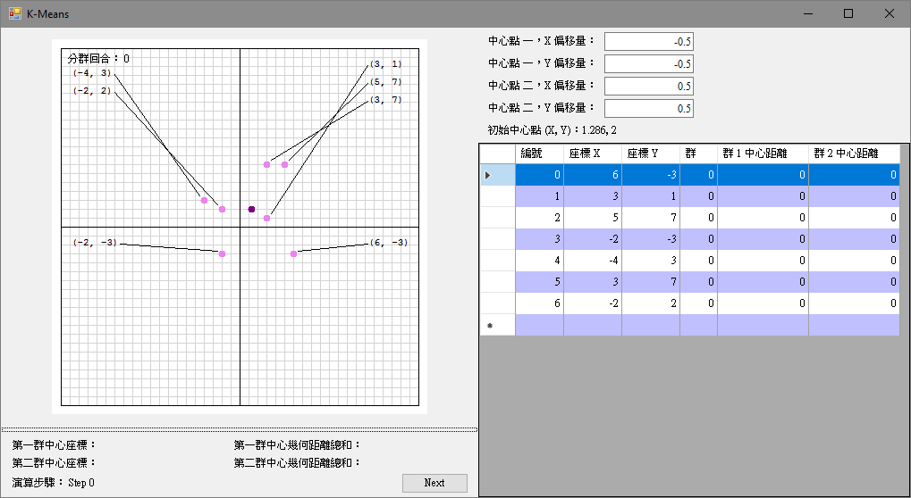
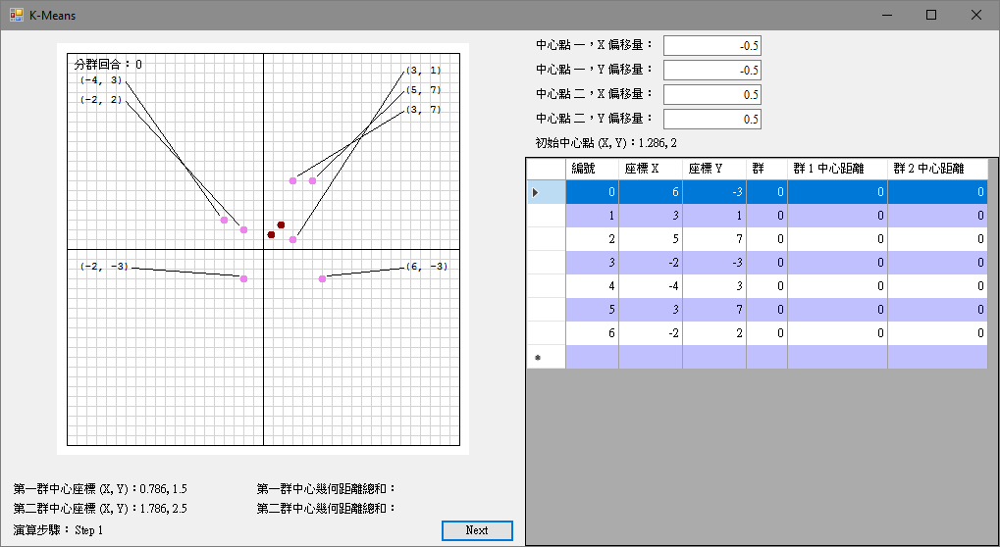
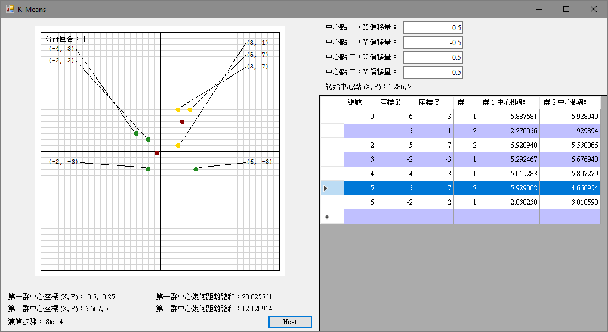
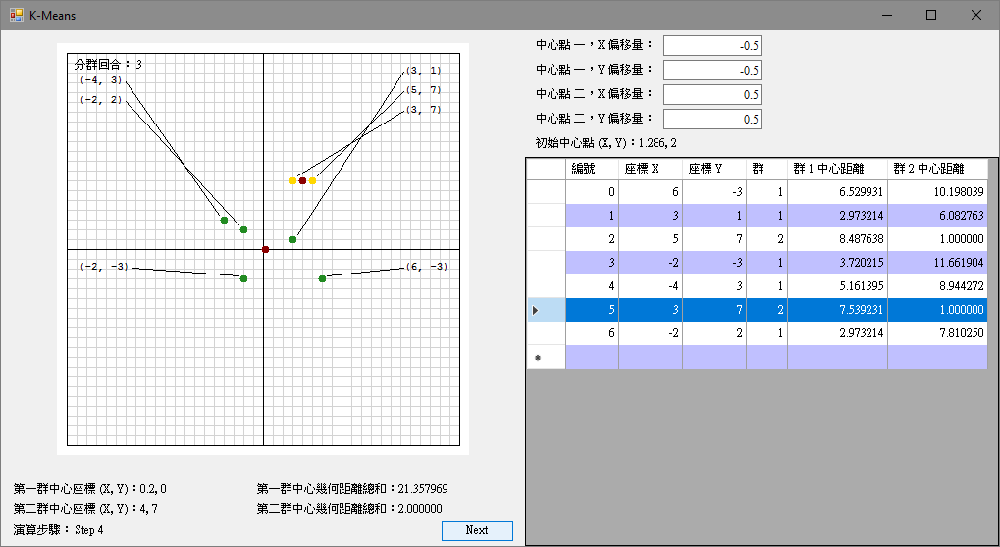

# K-Means

K-Means 參考：
 - https://zh.wikipedia.org/wiki/K-%E5%B9%B3%E5%9D%87%E7%AE%97%E6%B3%95
 - https://en.wikipedia.org/wiki/K-means_clustering
  
英文的比較詳細

# About this program

K-Means 分群算法，有不少演變，這個程式實作基本的方法。
幾個重點：
 - 程式分群，為兩群。
 - 起始分群座標會影響分群結果。
 - 結束條件，會影響執行時間(次數)。

# 起始中心座標 (Cx - 0.5, Cy - 0.5), (Cx + 0.5, Cy + 0.5)

# 起始中心座標 (Cx - 0.5, Cy - 0.5), (Cx - 0.5, Cy - 0.5)

